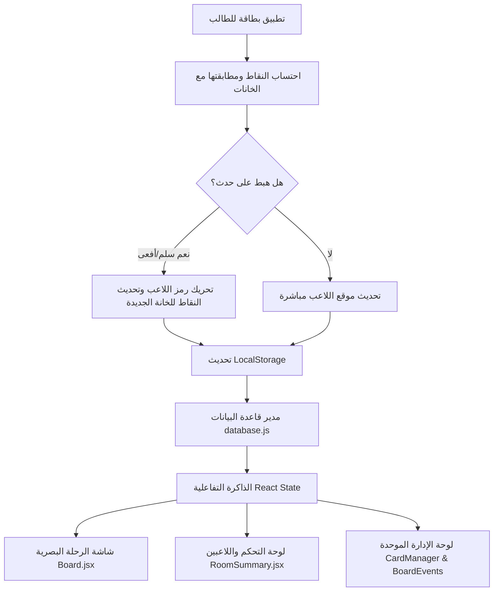

# الخطة التنفيذية المحدثة: لعبة السلم والحية التعليمية (رحلة نحو الأقصى)

نظام تفاعلي متكامل لتتبع تقدم الطلاب تربوياً وسلوكياً عبر محاكاة رحلة بصرية شيقة نحو المسجد الأقصى المبارك. يعتمد النظام على البطاقات لحساب النقاط والتقدم (الهدف النهائي 4300 نقطة). واجهة النظام كاملة باللغة العربية الفصحى.

---

## 1. نموذج البيانات المحدث (Database Schema)

سندير البيانات محلياً في المتصفح عبر `LocalStorage` باستخدام هيكل علائقي دقيق:

### جدول نسخ اللعبة (`GameRooms`)
```json
{
  "id": "string (UUID)",
  "name": "string (اسم النسخة)",
  "targetPoints": 4300,
  "status": "active | finished (نشطة | منتهية)",
  "winnerId": "string | null (معرف اللاعب الفائز)",
  "maxPlayers": "number (الحد الأقصى للاعبين)",
  "createdBy": "string (اسم المشرف)",
  "createdAt": "string (ISO Date)",
  "lastUsedAt": "string (ISO Date)"
}
```

### جدول اللاعبين (`Players`)
```json
{
  "id": "string (UUID)",
  "roomId": "string (UUID)",
  "name": "string (اسم اللاعب)",
  "points": "number (من 0 إلى 4300)",
  "position": "number (الخانة الحالية من 1 إلى 100)",
  "avatar": "string (رابط الصورة المصغرة أو الرمز التعبيري)",
  "color": "string (اللون المميز لرمز اللاعب)",
  "rank": "number (الترتيب الحالي)",
  "progressPercentage": "number (نسبة التقدم)",
  "lastCardApplied": "string | null (اسم آخر بطاقة تم تطبيقها)",
  "hasFinished": "boolean (هل وصل للهدف؟)",
  "updatedAt": "string (ISO Date)"
}
```

### جدول أحداث اللوحة (السلالم والأفاعي) (`BoardEvents`)
```json
{
  "id": "string (UUID)",
  "type": "ladder | snake (سلم | أفعى)",
  "startPosition": "number (الخانة التي تبدأ منها الحركة)",
  "endPosition": "number (الخانة التي تنتهي إليها الحركة)",
  "description": "string (المسمى التربوي للحدث، مثل: 'بر الوالدين' أو 'إهمال الواجب')"
}
```

### جدول البطاقات (`Cards`)
```json
{
  "id": "string (UUID)",
  "name": "string (اسم البطاقة)",
  "category": "string (تجويد | حفظ | متابعة تربوية)",
  "value": "number | null (القيمة الرقمية، null للقيم المتغيرة)",
  "color": "string (رمز اللون للبطاقة)",
  "isEnabled": "boolean (هل البطاقة نشطة؟)",
  "displayOrder": "number (ترتيب الظهور في اللوحة)",
  "isCustom": "boolean (هل هي مخصصة من المشرف؟)"
}
```

### جدول سجل العمليات التراكمي (`ActionLogs`)
```json
{
  "id": "string (UUID)",
  "roomId": "string (UUID)",
  "playerId": "string (UUID)",
  "playerName": "string",
  "cardName": "string",
  "pointsApplied": "number",
  "timestamp": "string (ISO Date)"
}
```

---

## 2. هيكل واجهة المستخدم وتجربة المستخدم (UI/UX)

تمت إعادة تصميم الواجهات لتكون باللغة العربية بالكامل وخالية تماماً من المصطلحات غير العربية، وتتوزع كالتالي:

### أ. لوحة التحكم والشاشات الرئيسية (الرئيسية)
* **ملخص الغرف النشطة**: بطاقات عرض لكل نسخة تشمل:
  - اسم النسخة، عدد اللاعبين الحالي/الحد الأقصى، اسم المتصدر الحالي، نسبة إنجاز النسخة الكلية، ووقت آخر استخدام.
  - أزرار تحكم مباشرة وسريعة: **دخول للعب**، **تعديل النسخة**، **أرشفة النسخة**.
* **جدول اللاعبين التفصيلي أسفل كل نسخة**:
  - يعرض مباشرة بشكل منسدل: `اسم اللاعب` | `النقاط الحالية` | `المتبقي للوصول (4300)` | `نسبة الإنجاز %` | `الترتيب الحالي` (🥇 للمركز الأول، 🥈 للثاني، 🥉 للثالث).

### ب. شاشة اللعب والرحلة البصرية (طريق الأقصى)
* **الخريطة التفاعلية**:
  - مسار متعرج مرسوم باستخدام SVG يعبر تضاريس ومعالم مدينة القدس، منطلقاً من البداية عند السهول والوديان، مروراً بمعالم تاريخية (مثل باب العامود، أشجار الزيتون، أسوار القدس القديمة، قبة الصخرة المشرفة) ووصولاً للمسجد الأقصى في القمة.
  - الخانات (1 إلى 100) مدمجة في ثنايا الطريق كأحجار مرصوفة.
  - الرموز التعبيرية للأطفال تتحرك بنعومة عبر المسار.
  - السلالم تظهر كجسور خشبية ذهبية، والأفاعي كمسارات شوكية أو حواجز حمراء.
* **تأثيرات الفوز والتكريم**:
  - عند وصول اللاعب للنقطة 4300، يظهر احتفال كامل بملء الشاشة مع ألعاب نارية تفاعلية وشهادة تكريم تفاعلية بالاسم، وتحديث حالة النسخة وحفظ الفائز، مع استمرار المنافسة لبقية المراكز.

### ج. لوحة الإدارة الموحدة (إدارة النظام)
صفحة تحكم رئيسية واحدة مقسمة إلى تبويبات لسهولة الاستخدام:
1. **إدارة النسخ**: إنشاء، تعديل، حذف، وأرشفة الغرف.
2. **إدارة اللاعبين**: إضافة طلاب للغرف، تعديل الألوان، تغيير الرموز الرمزية (Avatars).
3. **إدارة البطاقات**: تفعيل وتعطيل (`isEnabled`)، تغيير قيم البطاقات، تعديل الترتيب الظاهري (`displayOrder`)، وتحديد الألوان.
4. **إدارة السلالم والأفاعي (`BoardEvents`)**: لوحة تحكم ديناميكية كاملة لإضافة وحذف السلالم والأفاعي وتحديد نقاط البداية والنهاية والمسميات التربوية لها.
5. **النسخ الاحتياطي ونقل البيانات**: أزرار واضحة لتصدير ملف البيانات الكاملة بصيغة JSON، واستيراد الملف لاسترجاع كافة البيانات في أي وقت ومن أي متصفح.

---

## 3. معمارية وتدفق البيانات (Data Flow & Architecture)



---

## 4. مراجعة شروط التطبيق

> [!IMPORTANT]
> **قوانين صارمة لتلوين بطاقة السلوك والمشاركة**:
> * إذا كانت قيمة بطاقة السلوك أو المشاركة سالبة: يتم تلوين الزر فوراً باللون الأحمر الناري.
> * إذا كانت القيمة موجبة: يتم تلوينه باللون الأخضر اللامع.
> * للقيم المتغيرة: يتم إظهار حقل إدخال رقمي للمشرف قبل الاعتماد.
>
> **خلو الواجهة تماماً من اللغات الأجنبية**:
> * لن تحتوي أي نافذة، زر، عنوان، رسالة خطأ، أو واجهة داخل التطبيق على أي كلمة إنجليزية. النصوص بالكامل باللغة العربية الفصحى الفخمة والمناسبة لأعمار الطلاب.

---

## 5. خطة التحقق والتشغيل

1. **التحقق البصري**: اختبار مسار السفر للأقصى وتأكيد أن حركة الأيقونات سلسة ودقيقة.
2. **التحقق من البيانات**: اختبار التصدير والاستيراد وإغلاق المتصفح لضمان حفظ الحالة بنسبة 100%.
3. **التحقق من مرونة اللوحة**: إضافة وحذف سلم من لوحة الإدارة والتحقق من انعكاسه الفوري على الخريطة دون تغيير الكود.

يرجى تأكيد موافقتكم على هذه الخطة المحدثة لنبدأ البرمجة فوراً.
